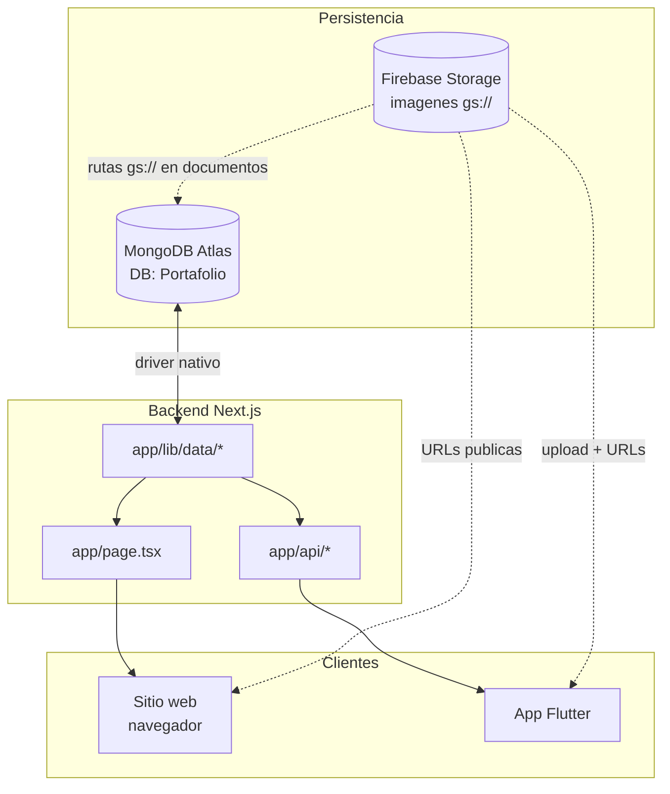
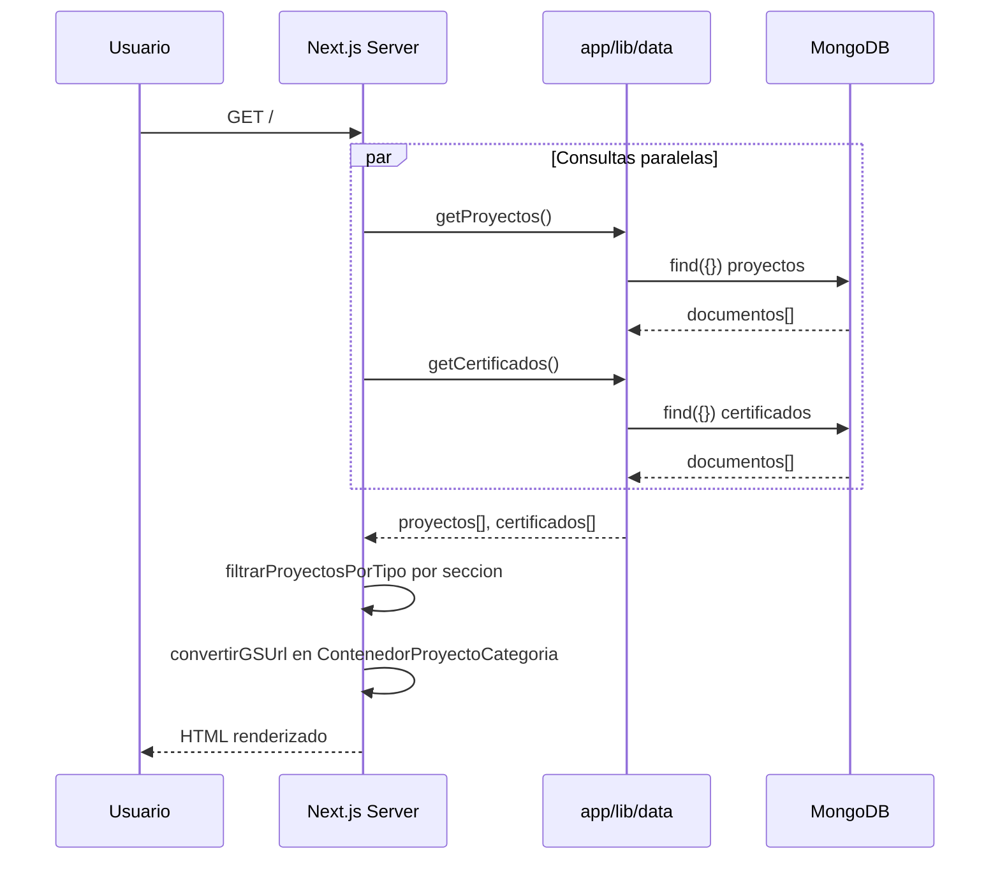
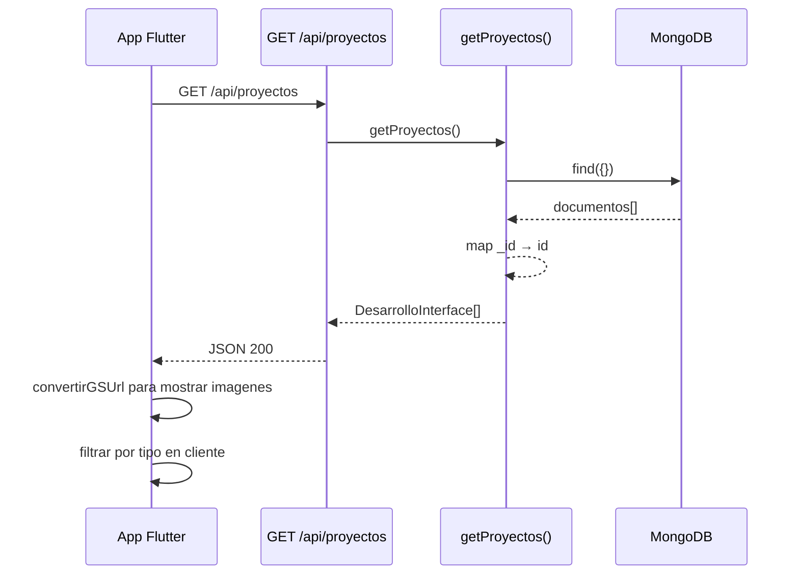
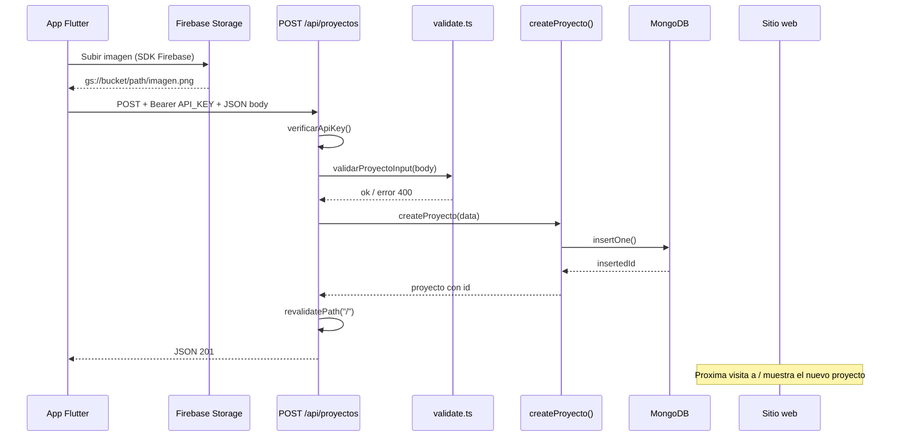
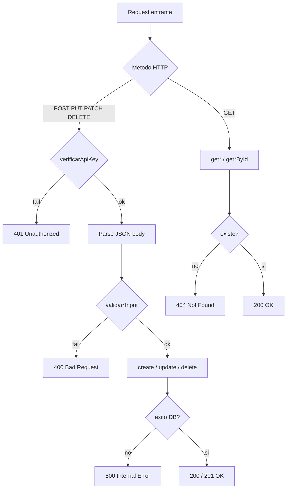

# Flujos de datos

Diagramas y secuencias que explican como se mueve la informacion entre MongoDB, el sitio web, la API REST, Firebase Storage y la app movil.

---

## 1. Flujo general del sistema



---

## 2. Flujo del sitio web (SSR)

El sitio **no consume la API HTTP**. Lee MongoDB directamente en el servidor.



### Pasos detallados

1. **`app/page.tsx`** ejecuta `Promise.all([getProyectos(), getCertificados()])`.
2. Cada seccion recibe solo los proyectos de su `tipo`:
   - `DesarrolloMovil` ← `"movil"`
   - `DesarrolloWeb` ← `"web"`
   - etc.
3. **`ContenedorProyectoCategoria`** gestiona tabs si hay 2+ proyectos del mismo tipo.
4. **`convertirGSUrl()`** transforma `gs://` → HTTPS antes de mostrar imagenes.
5. **`Logros`** recibe `certificados[]` y convierte cada `imagen`.

---

## 3. Flujo de lectura via API (app movil / externo)



### Puntos importantes

- **Sin autenticacion** en GET.
- La API retorna **todos** los proyectos; el filtro por `tipo` se hace en el cliente.
- No hay paginacion — el volumen es bajo (portafolio personal).
- Las imagenes vienen como `gs://`; Flutter debe convertirlas para `Image.network()`.

---

## 4. Flujo de escritura via API (crear proyecto)



### Orden obligatorio para imagenes

1. Subir archivo a Firebase Storage.
2. Obtener ruta `gs://...`.
3. Incluir esa ruta en `imagenes[]` o `imagen` del body JSON.
4. La API **no acepta** multipart/form-data ni binarios.

---

## 5. Flujo de actualizacion y eliminacion

### Actualizar (PATCH)

```text
App → PATCH /api/proyectos/:id + API_KEY + campos parciales
    → verificarApiKey
    → validarProyectoUpdateInput
    → updateProyecto (solo $set de campos enviados)
    → revalidatePath("/")
    → 200 + proyecto actualizado
```

### Eliminar (DELETE)

```text
App → DELETE /api/proyectos/:id + API_KEY
    → verificarApiKey
    → deleteProyecto
    → revalidatePath("/")
    → 200 { message: "Proyecto eliminado correctamente" }
```

> La API **no elimina** archivos de Firebase Storage. Si borras un proyecto, las imagenes pueden quedar huerfanas en Firebase (limpieza manual opcional).

---

## 6. Flujo de imagenes Firebase

```text
Almacenamiento (MongoDB)          Visualizacion (clientes)
─────────────────────────         ─────────────────────────
gs://bucket/proyectos/web/a.png
        │
        ▼
convertirGSUrl(gsurl)
        │
        ▼
https://firebasestorage.googleapis.com/v0/b/bucket/o/proyectos%2Fweb%2Fa.png?alt=media
        │
        ├──► next/image (sitio web)
        └──► Image.network (Flutter)
```

**Bucket del proyecto:** `portafoliodeibyramirez.firebasestorage.app`

**Logica de conversion** (identica en web y Flutter):

1. Quitar prefijo `gs://portafoliodeibyramirez.firebasestorage.app/`.
2. Reemplazar `/` por `%2F` y espacios por `%20`.
3. Armar URL con template de Firebase Storage REST API + `?alt=media`.

---

## 7. Flujo multi-proyecto por seccion

Cuando una categoria tiene varios proyectos (ej. 3 proyectos `tipo: "web"`):

```text
getProyectos()
    → filtrarProyectosPorTipo(..., "web")  → [proyA, proyB, proyC]
    → DesarrolloWeb recibe el array
    → ContenedorProyectoCategoria
           │
           ├── Tab "proyA" | Tab "proyB" | Tab "proyC"
           │
           └── Context { proyecto activo, imagenes HTTPS }
                    │
                    ├── Proyectos (card + modal)
                    └── Herramientas (acordeon)
```

Al cambiar tab, solo cambia el estado client-side; **no hay nuevo fetch**.

---

## 8. Flujo de errores en la API



---

## 9. Flujo CI/CD (build sin MongoDB)

```text
GitHub Actions
    → pnpm install
    → pnpm lint
    → pnpm build
         │
         └── page.tsx llama getProyectos() / getCertificados()
              │
              └── MONGODB_URI no configurada en CI
                   → catch error → retorna []
                   → build exitoso con secciones vacias
```

Ver detalle en [CI/CD](./ci-cd.md).

---

## 10. Comparativa: web vs API vs Flutter

| Aspecto | Sitio web | API REST | App Flutter |
| --- | --- | --- | --- |
| Acceso a datos | Directo `lib/data` | HTTP JSON | HTTP JSON |
| Lectura | SSR en servidor | GET publico | GET publico |
| Escritura | No (solo via API) | POST/PUT/PATCH/DELETE + key | Igual que API |
| Imagenes | `convertirGSUrl` en React | Retorna `gs://` | Debe convertir en Dart |
| Filtro por tipo | `page.tsx` en servidor | Cliente filtra | Cliente filtra |
| Auth | N/A | API key en escritura | API key en escritura |

---

## Documentos relacionados

- [Modelos](./modelos.md) — campos y tipos
- [Logica](./logica.md) — funciones y validacion
- [API REST](./api.md) — contrato HTTP
- [Guia Flutter](./flutter-guia.md) — implementacion en Dart
